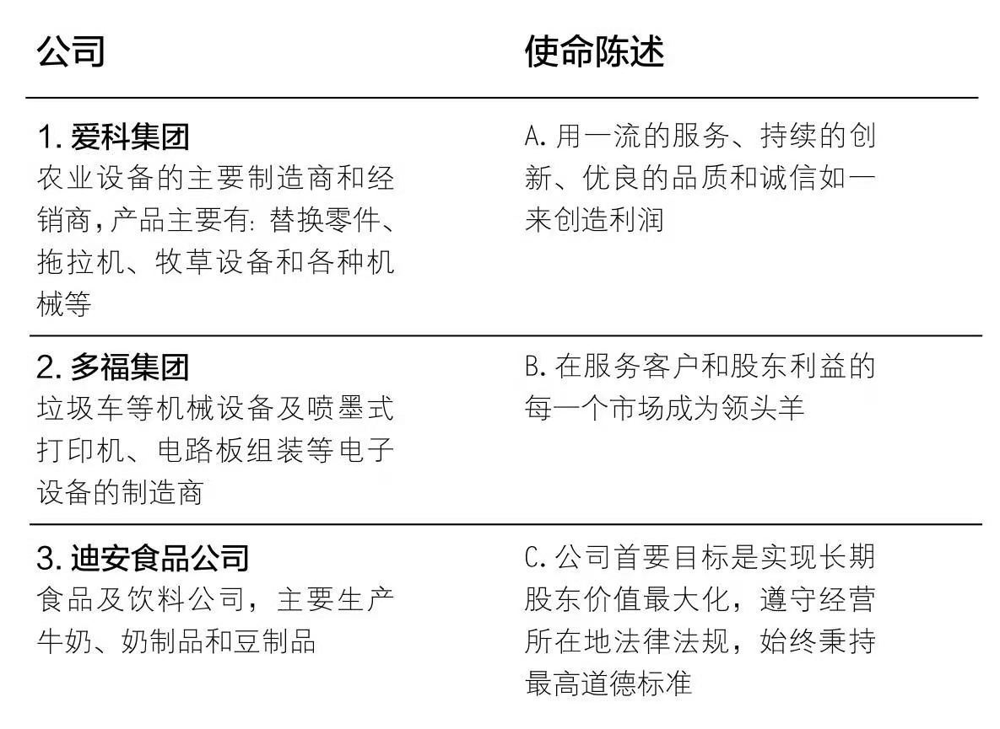

# day20190902-0915可亮天天问：《精要主义》

## 如何应对拥挤不堪的生活与工作：The Disciplined pursuit of Less（有纪律的追求更少）

### 作者：格雷戈·麦吉沃恩

- 20190902全书梗概（你在每天忙着加班吗？）
- 20190903前言（在开会与陪妻子和刚出生的宝宝之间怎么选？）
- 20190813第一章 跨出自己（什么是“意识流的写作手法”？）
- 20190904前言（如何追求更少？）
- 20190905（Part Ⅰ Essence | 精要主义者的核心思维模式）（嘤嘤嘤，无助感是从哪里来的？）
- 20190906（Part Ⅰ Essence | 精要主义者的核心思维模式）（买东西你是如何衡量价格的，X份黄焖鸡米饭？）
- 20190907（Part Ⅰ Essence | 精要主义者的核心思维模式）（要1亿美元，还是保客户安全？）
- 20190908（Part Ⅱ Explore | 精要主义者养成的第一步：探索）（你有众里寻他千百度的经历吗？）
- 20190909（Part Ⅱ Explore | 精要主义者养成的第一步：探索）（你有众里寻他千百度的经历吗？（完整版））
- 20190909（Part Ⅱ Explore | 精要主义者养成的第一步：探索）（你的世界观是如何形成的？）
- 20190910（Part Ⅱ Explore | 精要主义者养成的第一步：探索）（你还记得无聊的感觉吗？）
- 20190911（Part Ⅱ Explore | 精要主义者养成的第一步：探索）（为看《新闻联播》能赚钱？）
- 20190912（Part Ⅱ Explore | 精要主义者养成的第一步：探索）（小时候常玩的游戏对我们的帮助有多大？）
- 20190913（Part Ⅱ Explore | 精要主义者养成的第一步：探索）（为什么睡眠不是累赘？）
- 20190914（Part Ⅱ Explore | 精要主义者养成的第一步：探索）（在做决定时，你有明确的标准吗？）
- 20190915（Part Ⅲ Eliminate | 精要主义者养成的第二步：排除）（明明知道熬夜不好，为什么还是不舍得闭眼呢？）
- 20190916（Part Ⅲ Eliminate | 精要主义者养成的第二步：排除）（我们如何知道自己已经成功了？）
- 20190917（Part Ⅲ Eliminate | 精要主义者养成的第二步：排除）（你还记得自己与父母之间最难忘的时刻吗？）
- 20190918（Part Ⅲ Eliminate | 精要主义者养成的第二步：排除）（你会选择放弃一件事情吗？）
- 20190919（Part Ⅲ Eliminate | 精要主义者养成的第二步：排除）（如何编辑你的人生？）
- 20190920（Part Ⅲ Eliminate | 精要主义者养成的第二步：排除）（为什么不要替别人瞎操心？）
- 20190921（Part Ⅳ Execute | 精要主义者养成的第三步：执行）（没有套路的执行，就是耍流氓？）
- 20190922（Part Ⅳ Execute | 精要主义者养成的第三步：执行）（？）
- 20190923（Part Ⅳ Execute | 精要主义者养成的第三步：执行）（？）
- 20190924（Part Ⅳ Execute | 精要主义者养成的第三步：执行）（？）
- 20190925（Part Ⅳ Execute | 精要主义者养成的第三步：执行）（？）
- 20190926（Part Ⅳ Execute | 精要主义者养成的第三步：执行）（？）

### 20190902全书梗概（你在每天忙着加班吗？）

今天问题的核心是，忙碌的解决方案：

今年开始微信推文已经两个多月，算是养成了每天看书并输出读书成果的习惯，我知道这是一个终身有意的事情。可是我发现自己生活变得更加单调了，每天要花费两个小时的业余时间做这些。以前自己喜欢的好多事情都没有时间做了，比如，追美剧、看大片、跑步健身、玩滑板、做手工、和朋友聊微信……

为什么好多事情没有办法兼顾呢？如何才能更加高效呢？怎样才能更加合理的和时间相处呢？

抱着这些问题，我翻开了这本从党支部借来的《精要主义》。希望能找到一些我需要的解决办法。

请看本书的目录：
> 书名：精要主义
> 
> 副标题：如何应对拥挤不堪的工作与生活：The Disciplined pursuit of Less（有纪律的追求更少）
> 
> 中文版序：对话麦吉沃恩，精要的力量
> 
> 前言：设计人生，以一种精要的方式
> 
> Part Ⅰ Essence   | 精要主义者的核心思维模式
> 
> Part Ⅱ Explore   | 精要主义者养成的第一步：探索
> 
> Part Ⅲ Eliminate | 精要主义者养成的第二步：排除
> 
> Part Ⅳ Execute   | 精要主义者养成的第三步：执行
> 
> 结语：存在，设计你的精要人生
> 
> 附录：从精要主义者，到精要领导者
> 
> 译者后记：不在琐碎中无足轻重

本书的作者格雷戈·麦吉沃恩，是英国人，他被誉为“21世纪的斯蒂芬·科维”。（斯蒂芬·科维被美国《时代周刊》列为25位美国最有影响力的美国人之一，著有畅销书《高效能人士的七个习惯》。）麦吉沃恩在斯坦福大学开办了“设计你的精要人生”课程，备受青睐和追捧，他还是世界经济论坛全球青年领袖。

作者有如此多的荣誉褒奖，说明此书真有干货。接下来就让我们一起开始阅读吧！

### 20190903前言（在开会与陪妻子和刚出生的宝宝之间怎么选？）

今天问题的核心是，要自己安排生活：

前言中，作者介绍了本书的大概情况，主要包括成为精要主义者的必要性和做到精要主义的方法。在讲到自己是为什么开始研究精要主义时，作者讲了一个特别触动他的事件。

> 漂亮的新生儿正躺在疲惫母亲的臂弯里，我却还在接工作电话，回工作邮件，心中充满了会见客户前的那种压力和紧张。我的同事在邮件中写道：“星期五下午一点到两点之间最好别生孩子，因为我需要你过来参加会议，同客户见面。”现在正是星期五，尽管我非常肯定（或者说起码我希望）这个邮件不过是个玩笑而已，但依然感到了去参加会议的压力。
> 
> 我当然知道自己该干什么。这个时候我显然应该陪在妻子和宝宝身边。但是，当有人问我是否出席会议时，我鼓起勇气说……
> 
> “是。”
> 
> 当妻子和刚出生的宝宝躺在医院里的时候，我去参加了那个会议，这真令我羞愧难当。事后，我同事说：“你决定来参加会议，这会赢得客户的尊重。”但是，我并没有在客户脸上发现所谓的尊重。相反，他们都觉察出了我的不悦，这在他们脸上反映出来了。
> 
> 我到底干了什么？答应参加仅仅是为了不得罪人，而这样做却伤害了我的家庭，违背了我的原则，甚至还影响了客户关系。
> 
> 结果，那场会面没有产生任何结果。不过就算有了进展，这也是一个愚蠢的交易。为了让每个人都高兴，我牺牲了最重要的东西。
> 
> 在对这件事情的反思中，我学到了重要的一课：
> 
> **If you don't prioritize your life, some else will.**
> 
> **如果不能自己安排生活的优先次序，就只能任由别人替你安排。**

这是一个冲突十足的事件，在我们生活中很少发生，但是你肯定遇到过熬夜加班赶工作的情况（比如我现在还在写推文）。

那我们该怎么办呢？                                                          

作者祭出了它的重磅研究成果：

**精要主义者的核心思维模式：时间与精力只用于有意义的事。**

具体怎么做，让我们一起接着学习吧！

### 20190904前言（如何追求更少？）

今天问题的核心是，追求更少是铁律：

作者在前言中介绍了本书的组成部分和内在逻辑，很适合做我们阅读时的“地图”：

> 本书共分4个部分。第一部分勾勒了精要主义者的思维模式。接下来的3个部分将这种思维模式转化为一种系统化程序，用来执行“追求更少”这条铁律，你可以把它们用在你碰到的任何一种情况和做出的任何一种尝试中。
> 
> **精要主义者的核心思维模式：时间与精力只用于有意义的事情**
> 
> 这部分概述了我们试图躲避的三种现实，没有它们，精要思维就毫无意义或无从谈起。
> 
> >- 选择：我们可以选择 如何支配自己的精力和时间。
> >- 甄别：几乎一切都是噪音，只有少数事情价值非凡。
> >- 取舍：我们不能什么都有，也不能什么都做。
> 
> 只有理解了这些，我们才能像精要主义者那样思考。一旦彻底接受并理解了它们，那么本书中所提供的很多种方法在我们的生活和工作中就会变得自然而然，并成为一种本能。**践行这些方法要遵循一下3个简单的步骤。**
> 
> **探索：区分无意义的多数和有意义的少数**
> 
> 如果我们搜索“一个好机会”，会找到好多页的搜索结果。但如果我们可以进行高接搜索并且问3个问题：**令我深受启发的是什么？我特别擅长的是什么？在这世上能满足我重大需求的是什么？自然就不会有那么多搜索结果也需要查看了。**
> 
> 我们不是要找过多的好事情去做，而是寻找 个人贡献峰值的所在：**重要的事情，恰当的方式，合适的时间。**
> 
> 精要主义者在探索上面了尽可能多的时间，倾听、辩论、质问、思考。但并不是探索完就结束了，探索的最终目的是从无意义的多数里识别出有意义的少数。
> 
> **排除：摆脱无意义的多数**
> 
> 我们很多人答应一些事情，是因为要急于取悦别人或者让自己不同凡响。然而，说“不”才是实现个人贡献峰值的关键所在。**彼得·德鲁克曾说：“说‘不’可以让人变得高效，因为说‘不’的人会说‘这不是我的事’。”**
> 
> 考虑到取舍的现实性，我们不能选择什么都做。真正的问题不是我们怎样才能做到这一切，而是谁来决定我们做什么和不做什么。记住，**当我们丧失选择权的时候，别人会替我们做出选择。**所以，要么慎重地选择有所不为，要么不由自主任人摆布。
> 
> 本书这一部分提供一种淘汰非精要之事的方法，让我们赢得时间去做真正重要的事情。只有这样我们才能建立一种平台，尽可能地使执行变得毫不费力。
> 
> **执行：让有意义的少做起来毫不费力**
> 
> 不管是要完成一项工作任务，还是要迈向事业的新台阶，抑或是要为伴侣安排一个生日聚会，我们往往都会觉得执行的过程充满了困难和阻力，必须硬着头皮强迫自己去“完成”。
> 
> 精要方法却截然不同。**不是笔者自己去执行，而是把时间省下来创造一种方法，用来扫除障碍，使任务执行起来变得尽可能轻松自如。**
> 
> 探索，排除，执行并不是呈周期性循环的独立事件，若我们能持续运用，就能获得越来越多的收益。

这本书关于“追求更少”还真是逻辑清晰。共分两大块，心理思维方面和执行步骤方面。

我们从小到大通过课本学习新的知识就是这种模式：**先从各个方面理解一个概念——定义、适用范围、重要性等，然后开始具体介绍执行细节——步骤组成，实例讲解，操作反馈等。**

（现在总结出来这个模式……后知后觉呀……

要不是写这篇推文估计还不能这么深刻的理解呢，事半功倍地掌握一个概念的高效模式，以后一定好好运用好方法，耳濡目染影响下一代，哈哈）

理解了本书编排的内在逻辑，我有种预感，这本书我记得东西会更多的！

### 20190905（Part Ⅰ Essence | 精要主义者的核心思维模式）（嘤嘤嘤，无助感是从哪里来的？）

今天问题的核心是，习得性无助：

无助，我想大家都经历过那种被黑暗笼罩的时刻，《精要主义》也涉及了这方面的一些知识，让我们一起来看一下。

> 很久以来，人们过分强调了选择（我们面临的选项）的外部条件，而低估了选择（我们的行动）的内在能力。这不仅仅是一个语义学上的问题，试想一下，**选项（事物）会被拿走，而进行选择的核心能力（自由意志）却不会**。
> 
> 我们是如何以及为何忘记了选择的能力，关于这个问题有一种重要的见解来自马丁·塞利格曼（Martin Seligman）和史蒂夫·梅尔（Steve Maier）的经典作品。他们对德国牧羊犬进行实验时偶然发现了一种现象，后来将其称为“习得性无助”。
> 
> > 塞利格曼和梅尔将一群狗分成三组。
> > 
> >- 第一组狗被拴上了系带，并被施以电击，但它们可以压下操作杆来停止电击。
> >- 第二组狗被拴上了同样的系带，分到了同样的操作杆，面临同样的电击，不过有一个陷阱：操作杆坏了，致使狗无法对付电击。
> >- 第三组狗仅仅被拴上系带，不施加电击。
> >
> > 然后，所有狗都被放到了一个笼子里，笼子中间放置有一块隔板，隔板的高度是狗可以轻易跳过去的。隔板的一边有电击，另一边没有电击。
> >
> >有趣的现象出现了。那些在前期的实验中能够停止电击或者没有遭到电击的狗很快学会了跳过隔板，到达没有电击的那一边。但是无力应对电击的那些狗没有这么做，它们没有做出反应或调整，没有采取任何措施来避免电击。
> >
> >这是为什么呢？因为除了遭受电击，他们不知道还有其他的选择。它们有了习得性无助。

由此看来，无助感是从我们以往地生活经验得来的。

我曾经特别好奇，健壮雄伟的大象为什么会忍受和它们比起来非常弱小的人类呢？直到我看了一期泰国人训练大象的视频节目，我才明白了，是因为了它们放弃了抵抗。

在大象还是小象宝宝的时候，人类便用大铁链子拴着小象，训练它们做一些动作。训练工具是像镰刀一样一头尖利的钩子，可以穿透大象粗糙的皮肤，通常刺在它们敏感的头颈和耳后，让它们流血结痂。**经过长时间的虐待和折磨，小象便放弃了抵抗，即便铁链变细了，或者他们长大变得更有力量了，也不再想办法逃走。**

可见，**意识到自己有选择的自由，并不惜代价争取选择的自由，是一件无论怎么强调都不为过的事情！**

对了，附上这一部分的目录：

> Part Ⅰ Essence | 精要主义者的核心思维模式
> 
>- 导读：时间与精力只用于有意义的事
>- 模式一：选择，一种战无不胜的力量
>- 模式二：甄别，几乎一切都是噪声
>- 模式三：取舍，我要的究竟是什么

### 20190906（Part Ⅰ Essence | 精要主义者的核心思维模式）（买东西你是如何衡量价格的，X份黄焖鸡米饭？）

今天问题的核心是，无意义的多数：

关于如何甄别更有意义的事情，作者举了一个自己小时候的例子：

> 记得小时候，我想挣点儿零花钱。那时在英国，当报童是一个12岁的孩子能找到的仅有的几份工作之一，一天的工钱是一英镑，工作时间大概是一小时。因此，在一段时间里，我们天早上上学前，都会拉着一个看上去比我还重的大袋子，挨家挨户的送一小时报纸（顺便说一下，我们不能把报纸扔到人家门廊上就走，这和美国不一样。我们必须要把报纸拿起来用力整个儿塞进人家家门上的小信箱里）。这点儿零花钱挣得着实不易。
> 
> 为了每天挣着一英镑，我历经千辛万苦，这永久而彻底地改变了我对心仪事物所需成本的看法。从那时起，**每当我想要买什么东西的时候，我都会把它换算成我需要送多少天报纸来衡量。一英镑的报酬等于一小时的奔波忙碌**。我发现，按照这种比率计算，买一辆自己喜欢的玩具小汽车需要攒好一阵子的钱。
> 
> 然后，我开始琢磨如何才能加快赚钱的速度，我想到了自己周六上午可以不去送报纸而去给邻居家洗车。每辆车两英镑，我可以在一小时之内洗三辆车。突然，工作时间和英镑的比率由1:1变成了1:6.这给我上了重要的一课：某种工作会比其它工作带来更多的报酬。

作者小时候这种衡量心仪东西价格的方式和我现在的做法异曲同工。比如我看上了一本得到APP的精选课程，我就会先算算买下这门课的钱够我吃几顿黄焖鸡米饭（这是升级版了，刚来北京的时候都是以基础版烤冷面为参考系）。

一顿黄焖鸡米饭——买！毫不犹豫。两顿黄焖鸡米饭——为了学习，买……吧。三顿黄焖鸡米饭——我还是再等等，等到连续学习了21天，争取了10元的得到奖学金券时再买吧。

这应该是就是**贫穷限制了我的想象力了吧**。

后来我从我买的课程学习到赚钱的四种境界：

- 1.拿时间换钱：付出多少，回报多少，不付出，就没有回报；
- 2.那作品赚钱：一份作品花费一段时间，但是每卖出一份都能赚到钱；
- 3.靠平台赚钱：出售别人的作品，只是靠卖别人作品抽成赚钱；
- 4.用钱去赚钱：用钱投资别人，让别人花时间、精力替自己赚钱。

看来就像作者格雷戈·麦吉沃恩说的：“**努力工作当然重要，但并不是说更努力就一定可以带来更多收获。‘更少，但更好’可以。**”

让我们好好研究研究自己，看看有没有什么能力可以做到花时间最少，但是做得更好的。

### 20190907（Part Ⅰ Essence | 精要主义者的核心思维模式）（要1亿美元，还是保客户安全？）

今天问题的核心是，取舍：

看了选择，知道了甄别，让我们再来学习一下取舍。今天我读到了第三种思维模式，取舍。

> 我在工作中注意到，公司高管是对取舍现实性接受程度最差的人。我最近接触了硅谷一家市值400亿美元公司的首席执行官。他跟我分享了他刚刚编写的，准备向全公司宣布的公司价值宣言：**我们珍视激情、创新、执行和领导力**。
> 
> 这份宣言的问题之一就是，有谁会不珍视这些？另一个问题是，它并未告诉员工，公司最珍视的是什么。他并没有向员工指明，这些价值观发生冲突的时候，他们应该选择什么。
> 
> 一些公司宣称，自己的使命是平等地服务所有利益相关者——客户、员工、股东。这其中也存在类似的问题。宣称对所有相关人士都同等重视就是给管理留下难题，因为没有明确指出若要对自身服务的人群进行权衡取舍，我们应该如何选择。
> 
> 与这形成对照的是，强生公司成功地从1982年的一次灾难性氰化物谋杀丑闻中东山再起的故事。
> 
> 当时，强生公司占有37%的市场份额，泰勒诺是其最盈利的产品。那时，有报道称有7人服用泰勒斯后死亡。经调查是装药的瓶子被动了手脚。强生公司该如何做出回应呢?
> 
> 这个问题极其复杂。他们首要的任务是召回药店货架上的全部泰勒诺产品以保障客户安全呢？还是通过危机公关来控制损害并防止股东抛售公司股票？又或者是第一时间安慰并补偿受害人家庭？
> 
> 幸运的是，他们有自己的信条。当时的公司董事长罗伯特·伍德·约翰逊（Robert Wood Johnson）曾于1943年写下一则宣言，被全文刻在了强生公司总部的一块石头上。与大多数公司使命不同，这则信条对公司的组成人员进行了主次排序：**客户第一，股东最后**。
> 
> 结果，强生公司迅速决定召回全部泰勒诺产品，即使这将对公司造成巨大损失（据报道，涉及金额高达1亿美元）。**是选择客户安全还是1亿美元？**这不是一个轻易做出的决定。但是公司的信条让他们对“什么是最重要的？”这个问题没有任何任何疑问，并促成了一次艰难的取舍。

**取舍**，这真不是一件容易的事情。但推崇“**凡事都有方法论**”的李笑来老师（终身成长者）可以帮你做取舍——**打磨自己的价值观**。

什么是价值观，我理解的是，**价值观是我们用来判断一个东西或事情对我们是否有价值的一套原则体系**。强生公司正是拥有自己明确的信条，即清晰的价值观，才能在风口浪尖没有翻船的。

李笑来老师打磨价值观的心法口诀只有一句：**什么是更重要的**！遇到取舍问题便问自己，如此不断思考，你便会得到“**什么是最重要的？**”答案。

我现在的价值观排序是：**身心>家庭>事业**。你的呢？

### 20190908（Part Ⅱ Explore | 精要主义者养成的第一步：探索）（你有众里寻他千百度的经历吗？）

今天问题的核心是，总结概括能力：

**众里寻他千百度，蓦然回首，那人却在灯火阑珊处**。我可不是在做广告（倒是非常希望能接到广告赞助哦），只是这句词太能反映我的的心境了！

不卖关子了，给大家讲一讲。我小 学时候语文特别差，那时间我数学满分，但是语文就是考不过80分。我妈老说我：“使劲儿学学语文，可不能瘸腿走路！”所以语文是我一直的痛，而阅读理解就更痛。那时间做阅读题，像什么，这个字在文中起什么作用？ 这一段作者主要说了什么？本篇文章的中心思想是什么？等等，我都手足无措。

所以在开始公众号写作的时候，我有一个小小的心愿——**学习并锻炼一下我的总结概括能力**。没曾想到，在今天我回头看第一部分都讲了什么的时候，就忽然开窍，发现了总结的秘密……

《精要主义》这本书结构非常清晰：前言（点击即可跳转）中已经将全书编排逻辑作了梳理。我原本没有发现中间体现了超级强的概括能力（我之前看书基本不怎么看前言，也不知道前言的具体作用）。作者格雷戈·麦吉沃恩在前言中介绍本书主要有两部分组成：第一部分主要讲精要主义的核心思维模式；第二、三、四部分是对精要主义的践行的三个步骤，清晰简练明了（我都可以开始评价作者的行文风格了，哇哦）。

还有，每小节都有关键词的总结，像选择、甄别、取舍等；每部分的开始都有主要内容的介绍——导语，下边我们看看第一部分的导语：

> **导读：时间与精力只用于有意义的事**
> 
> 精要主义不是一种教人再多做一件事情的方法，而是一种教人如何做事的不同方法。它是一种思维方式，但要吧这种思维方式内化于心绝非易事。因为某些固有的想法总被人兜售推销，它们不断地把我们拉回到非精要主义的逻辑上来。该部分中每章都会呈现一个非精要主义的谬误，然后用精要主义的正确方法来改正它。
> 
> 像精要主义者那样行事，我们必须克服三种根深蒂固的想法：“我必须做”，“这些都重要”以及“我能二者兼顾”。这些想法仿佛神话中的海妖，危险而可怕有魅力十足，会引诱我们坠落并淹没在浅水水域里。
> 
> 要抓住精要主义的本质所在，我们应该摒弃这些错误的思维，拥抱三条核心真理：“我选择我要做的事”，“只有小部分事情是重要的”以及“我能做任何事情但不是所有事”。这些简单的真理把我们从非精要主义的浑浑噩噩中惊醒，让我们去自由地追求真正重要的事情，并实现个人贡献峰值。
> 
> 拂去非精要主义的重重迷雾，代之以精要主义的核心逻辑，我们就会自然而本能地像精要主义者那样行事。

所以，我们可以那这本书当作范本，来学习提取文章中心思想的能力。关键字、关键词、关键句、关键总结。

接下来，我们要开始读第二部分了，下边是目录，可以试试我今天的方法，预测一下主要内容哟：

> Part Ⅱ Explore | 精要主义者养成的第一步：探索
> 
>- 导读：区别无意义的多数和有意义的少数
>- 要素一：抽离，为探索和思考留出空间
>- 要素二：审视，关注真正重要的事
>- 要素三：游戏，拥抱内心孩童般的智慧
>- 要素四：睡眠，保护你的身心资产
>- 要素五：精选，只接受前10%的机会

### 20190909（Part Ⅱ Explore | 精要主义者养成的第一步：探索）（你有众里寻他千百度的经历吗？（完整版））

今天问题的核心是，总结概括能力：

**众里寻他千百度，蓦然回首，那人却在灯火阑珊处**。我不是在做广告（倒是非常希望能接到广告赞助哦），只是这句词太能反映我此时的心境了！

不卖关子了，给大家从头道来。

我小学语文特别差，那时我数学能得满分，但是语文就是考不过80分。我妈老说我：“使劲儿学语文，可不能瘸腿走路！”但是，语文一直也没有多大起色……于是语文就成了我的伤痛。

提起阅读理解，就更是痛中之痛了！那时间做阅读题，像什么，这个字在文中起什么作用？ 这一段作者主要说了什么？本篇文章的中心思想是什么？等等，我都手足无措。所以我在开始公众号写作的时候，就有一个小小的心愿——**学习并锻炼一下我的总结概括能力**。没曾想到，在今天我回头看《精要主义》第一部分都讲了什么的时候，就忽然开窍，发现了总结的秘密……一些突出文章核心内容的关键部分。

1、《精要主义》这本书结构非常清晰：前言（点击即可跳转）中已经将全书编排逻辑作了梳理。（我之前看书基本不怎么看前言，也不知道前言的具体作用）。本书主要有两部分组成：第一部分主要讲精要主义的核心思维模式；第二、三、四部分是对精要主义的践行的三个步骤，清晰简练明了（我都可以开始评价作者的行文风格了，哇哦）。

2、每部分的开始都有本部分主要内容的介绍——导读，下边我们看看第一部分的导读：

> **导读：时间与精力只用于有意义的事**
> 
> **精要主义不是一种教人再多做一件事情的方法，而是一种教人如何做事的不同方法。**它是一种思维方式，但要吧这种思维方式内化于心绝非易事。因为某些固有的想法总被人兜售推销，它们不断地把我们拉回到非精要主义的逻辑上来。该部分中每章都会呈现一个非精要主义的谬误，然后用精要主义的正确方法来改正它。
> 
> 像精要主义者那样行事，我们必须克服三种根深蒂固的想法：**“我必须做”，“这些都重要”以及“我能二者兼顾”。**这些想法仿佛神话中的海妖，危险而可怕有魅力十足，会引诱我们坠落并淹没在浅水水域里。
> 
> 要抓住精要主义的本质所在，我们应该摒弃这些错误的思维，拥抱三条核心真理：**“我选择我要做的事”，“只有小部分事情是重要的”以及“我能做任何事情但不是所有事”。**这些简单的真理把我们从非精要主义的浑浑噩噩中惊醒，让我们去自由地追求真正重要的事情，并实现个人贡献峰值。
> 
> 拂去非精要主义的重重迷雾，代之以精要主义的核心逻辑，我们就会自然而本能地像精要主义者那样行事。

3、每一章节作者都提取了浓缩核心内容关键字，像第一部分的三种思维方式：**选择、甄别、取舍**，给我们增添了记忆索引按钮，一拉一串就出来了，减轻了我们的记忆负担。

4、每个章节的开头处特意添加了“非精要主义者”和“精要主义者”的特征对比，告知我们主要内容，也引领我们阅读思考；

5.每个张杰的结尾处都有精炼的要点总结，又一次强化我们的认知和记忆：

如此看来，我们可以拿这本书当作范本，来学习提取文章中心思想的能力。关键字、关键词、关键句、关键总结等。

接下来，我们要开始读第二部分了，下边是目录，可以试试我今天的方法，预测一下主要内容哟：

> Part Ⅱ Explore | 精要主义者养成的第一步：探索
> 
>- 导读：区别无意义的多数和有意义的少数
>- 要素一：抽离，为探索和思考留出空间
>- 要素二：审视，关注真正重要的事
>- 要素三：游戏，拥抱内心孩童般的智慧
>- 要素四：睡眠，保护你的身心资产
>- 要素五：精选，只接受前10%的机会

### 20190909（Part Ⅱ Explore | 精要主义者养成的第一步：探索）（你的世界观是如何形成的？）

今天问题的核心是，探索的力量：

承接昨天的内容，我们知道了第二部分的五个的关键词是：**抽离、审视、游戏、睡眠、精选**。那，这几个关键词的由来是什么呢？让我们看看介绍这部分主要传达什么内容的导读吧。

> **导读：区别无意义的多数和有意义的少数**
> 
> **精要主义的一大悖论就是相比非精要主义者，精要主义者实际上会探索更多的选择项。**几乎所有的事情都能引起非精要主义者的兴趣，也会引起他们的反应。但是，正因为如此忙于追逐每一个机会和每一种想法，他们实际上在选项上花费的精力少之又少。相反，精要主义者的做法是专注于某项事情之前，先广泛地探索和评估各种选项。**因为精要主义者只在少数重要的想法和事情上集中精力“大干”一场，他们最开始时探索更多的选项，就能保证以后做出的选择是正确的。**
> 
> 在这一部分，我们将讨论探索精要之事的5个要素。非精要主义的巨大牵引力或许会让人忍不住跳过这个要素或者仅仅是匆匆一瞥。但是，这个要素本身对于人们实现自律的追求更少具有极其重要的意义。**要识别出什么是真正重要的，我们需要思考的空间，需要观察和倾听的时间，需要有享受娱乐的心态，需要聪明地让自己该睡就睡，需要在做出选择时自觉自律地运用严格的选择标准。**
> 
> **具有讽刺意味的是，在非精要主义者看来，空间、倾听、娱乐、睡眠和选择等都是毫无意义、会导致人们分心的事物。**他们最多不过是被视为可有可无，有也不错，最次还可能被诋毁成软弱和浪费的证明，众所周知，野心勃勃或者工作高效的人是这样想的：“当然，我很想从工作日程表中留出一些时间出来，专门用来思考，但这是一种奢侈品，我现在用不起。”或者是：“玩？谁有时间玩？我们是来这里工作的！”或者，就像在一次员工入职过程中，一位领导更我说的那样：“但愿你晚上能睡个好觉。在这里，这并不容易实现。”
> 
> 如果你相信，过分忙碌和把时间用到极致是工作高效的证据，那么也可能会认为探索、思索和反省所占用的时间应该被降到最低。然而，正是这些“可有可无”的活动为非精要主义者焦头烂额的忙碌提供了一种解毒剂。**这些活动非但不是毫无意义、令人分心的，反而还是将真正的分心物和真正的要事区分开来的关键环节。**
> 
> 精要主义者将尽可能多的时间用于探索、倾听、辩论、质问和思考。**但是，探索本身并不是他们的目的，真正的目的在于将有意义的少数从无意义的多数中甄别出来。**

这个导读言简意赅的像我们传达了两点内容：**第一点是，想要做出正确的选择，就要探索更多的选项，从而将有意义的少数从无意义的多数中甄别出来。另一点是，要想充分探索并识别重要的，就需要保证思考的空间、观察和倾听的时间、享受娱乐的心态、该睡就睡和遵守严格的选择标准。**

知道了这些，我想，接下来我们便可以从这5个要素入手，好好研读研读它们是如何将真正的分心物和真正的要事区分开来的了。

对了，回过头来再说说世界观。我特别赞成刘润老师的话——**没有“观世界”，哪有“世界观”。**（出自：《人生，既要朝九晚五，也要浪迹天涯》）我们在课本中看到的世界，在象牙塔中听说的世界，在脑袋中臆想的世界，都是片面的、平面的、灰色的。我们只有将自己置身于其中，主动去探索：感受、体会、欣赏，才能有一个全面、立体、彩色的对世界的认识。

### 20190910（Part Ⅱ Explore | 精要主义者养成的第一步：探索）（你还记得无聊的感觉吗？）

今天问题的核心是，探索的力量：抽离，为探索和思考留出空间：

今天我看了探索部分的第一个要素：抽离。其中提到了“无聊”，让我得到了启发。

> **你有多久没有未从忙忙碌碌的一天里专门抽出时间，坐下来好好思考一下了？**
> 
> 我不是指你每天早晨上班路上抽出5分钟来列一个今日必做事项清单，也不是指你在开会时溜会儿号琢磨琢磨手头那个项目该怎么做。我指的是，**有意识地留出没有分心物的时间和没有分心物的空间，除了思考，绝对不做任何别的事情**。
> 
> 今天的世界充斥着各种玩意儿，人们受着过度的刺激，因此，毫无疑问，如今要实现这样的专注思考已是难上加难。
> 
> Twitter公司的一位领导人曾问过我：“你还记不记得无聊是什么感觉？这种感觉再也不会出现了。”他说的一点不错，也就是在几年前，如果你因为航班晚点而被困于机场，或者在候诊室时，你可能会坐在那儿，发呆发愣，百无聊赖。然而现在，所有在机场候机的人何在候诊室里等待的人都会选一样高科技工具，死死地盯着不放。
> 
> 当然，没有人喜欢无聊，**然而一旦所有无聊的机会都被剥夺殆尽，我们同样丧失了可以用来思考的时间**。

想起我最近一次“无聊”还是七月初，那时间我们租的房子因为产权原因被掐了电。因为没有了电，所以手机就要省着点儿用。我只好发呆，或者扣指甲。但是也只度过了无聊的半个小时，因为第二天我便在公司把3个充电宝蓄满了电。

我深深地体会到，每天有段自己思考的时间和空间是非常非常难得的事情。

但是每天忙碌只会让我们疲于奔命，成为习惯的奴隶。因为我认为，**谁支配了大脑，谁就是我们生活的主人**。

每天找段时间，找个地方，自己安安静静地思考一下，忙碌的生活之外我们还能得到什么。

PS：要素一的精要TIPS
- 为自己创造探索和思考的空间。
- 适时抽身，退一步看清局势。
- 用每天的第一个20分钟来阅读经典。

### 20190911（Part Ⅱ Explore | 精要主义者养成的第一步：探索）（为看《新闻联播》能赚钱？）

今天问题的核心是，探索的力量：审视，关注真正重要的事情：

今天我看了探索部分的第二个要素：审视。这节开篇讲了一个小故事，使我受益良多，分享给大家。

> 已故作家诺拉·艾芙隆（Nora Ephron）最出名的作品包括《希尔克伍德》《西雅图未眠夜》《当哈里遇见莎莉》，每一部都获得了奥斯卡奖的提名。作为作家和编剧，艾芙隆的成功在很大程度上要归因于她捕捉故事精华的能力——这一技能是她当年当记者时候练就的。但是，在高强度的新闻工作生涯中，对艾芙隆影响最深远的一课，还要追溯到她的高中时代。
> 
> 查理·西姆斯（Charlie O.Simms）在比弗利山庄高中教一门新闻学课程。开学第一天，他的讲课和艾芙隆上过的任何一门新闻学课程并无二致，也是解释“导语”这个概念。他解释说，**一个导语必须包含这篇新闻作品的“何时”、“何地”、“何事”、“何因”、“何人”这些要素，这些正是最重要、最精华的信息**。然后他给大家布置了第一项作业：为一个故事写一段导语。
> 
> 西姆斯提供了与这个故事有关的一些事实：“比弗利山庄高中的校长肯尼斯·彼得斯今日宣布，比弗利山庄高中全体教员将于下周四赴萨克拉门托参加一场有关新型教学法的学术讨论会。人类学家玛格丽特·米德、大学校长罗伯特·梅纳德·哈钦斯，以及加州州长艾德蒙·杰·布朗将会到会并发言。”
> 
> 学生们噼里啪啦的敲打着键盘，努力要跟上老师的节奏。然后，他们纷纷交上了自己的“急就章”导语。这些导语每一篇都试图尽可能简明扼要地概括出“何时”、“何地”、“何事”、“何因”、“何人”这些要素：“格丽特·米德、大学校长罗伯特·梅纳德·哈钦斯，及加州州长艾德蒙·杰·布朗将向全体教员发表讲话，主题是……”“下周四，高中全体教员将……”西姆斯检查了学生们写的导语，然后把它们放到了一边。
> 
> 接下来，他告诉学生们，所有人写的都不对。他说，这个故事的导语正确的写法应该是**“本周四不上课”**。
> 
> “在那一瞬间，”艾芙隆回忆说，“我懂得了，**新闻学不仅仅意味着要反刍事实，而且还要把握重点。弄清楚什么人、什么事、什么地方和为什么这些要素是不够的，还要理解这篇新闻到底意味着什么，以及它为什么重要。**”艾芙隆还补充说：“他教我的某些东西不仅适用于新闻工作，也同样适用于生活中。”

从这个故事，我得到的启示是，**虽然导语要包含新闻作品的五种要素，但是我们要明确一件事情，新闻事实本身对读者来说没有任何用处，挖掘这些事实对读者的意义才是最重要的**。

有一个发生在我们身边的故事，也反映了这个道理。很多股票持有者，因为看CCTV的《新闻联播》赚了好多钱。有的人总结这背后的逻辑，说是因为这些人能从新闻联播中看到国家的发展趋势和政策方向。之后他们根据发展趋势和政策方向迅速做出抛售或者买入的决定。（我认为这个推测有一定的道理，但不全面，毕竟股票涨跌是一件涉及众多因素的事情，不能一概而论。）**显而易见，不是新闻内容涉及股票购买建议使得故事中的人大赚一笔，而是因为他们发现了新闻内容背后反映的规律才使他们获利的。**

看来以后我的推文不能仅仅浮于表面，只是给大家介绍文章内容了。我要提取书中的精华，并深入挖掘这些精华能带给我们价值和意义，以便达到学以致用、为我们所用的目的。

PS：要素二（审视）的精要TIPS
- 放眼全局，而不是纠缠细节。
- 去粗取精，自律地调查筛选。
- 写日记，称为自己人生的记录者。
- 实地探索，认清问题的本质。
- 捕捉不正常和不寻常的细节。
- 明确问题，走出逃避推诿的怪圈。

### 20190912（Part Ⅱ Explore | 精要主义者养成的第一步：探索）（小时候常玩的游戏对我们的帮助有多大？）

今天问题的核心是，探索的力量：游戏，拥抱内心孩童的智慧：

今天我看了探索部分的第三个要素：游戏。这里大力赞扬了游戏对促进探索和创造做出的重要贡献。

> 斯图亚特·布朗写道：“然而在所有的动物物种中，人事类是最会玩儿的。我们生来会做游戏并且在游戏中生存发展。**当我们玩儿的时候，人性得到了最纯粹的表达，个性得到了最真实的展现。**游戏的那一刻，我们最深刻地感到自己活着，我们最美好的回忆也正是来源于此，还有什么好奇怪的吗？”
> 
> 游戏鼓励我们进行新的探索，拓宽思维的疆域：**创造新的思想，对旧想法进行全新的审视。它让我们具有更强烈的好奇心，更能适应新奇的事物，更热衷于积极参与**。游戏是成为精要主义者的根本条件，因为它起码以三种特殊的方式为人类的探索行为添砖加瓦。
> 
> **首先，游戏拓展了人们的选择范围**。它能帮助我们看到平常会忽略的种种可能性，并建立一种原本无法建立的联系；它能开阔视野，开放视角；它有助于我们挑战旧观念，更加乐于接受未经检验的新思想；它鼓励我们扩大自己的意识流，构建新故事。或者，就像爱因斯坦曾说的那样：“在我审视自身和自己的思考方式时，我得出的结论是，对我而言，幻想的天分比我积极吸收知识的才能更重要。”
> 
> **其次，游戏是解压药**。这种共用非常重要，因为压力不仅会导致产生效率降低，而且还会抑制创造力，扼杀好奇心，损坏大脑的探索功能。这样的感觉你一定不陌生：工作压力让你透不过气来，突然一切都不对劲儿了——你找不到钥匙，动不动就撞到东西，重要的报告落在厨房的餐桌上了。最新的研究成果表明，这种情况是由于压力导致大脑中情绪监测部位（杏仁核）活动增加，而同时大脑中负责认知功能的部位（海马体）活动减少——结果很简单，那就是我们无法清晰地思考。
> 
> 我亲眼见过游戏在我孩子身上产生的与之相反的效应。当他们焦虑不安、无法控制事情的时候，我让他们画画，变化几乎立马就能出现。压力解除了，孩子们的探索能力失而复得。
> 
> **最后，游戏对于大脑的执行功能可以产生积极的影响**。正如专门研究脑科学的精神病学家爱德华·哈洛韦尔（Edward M.Hallowell）解释的那样，“大脑的执行功能，包括制定计划、区分主次、安排日程、预先准备、委派任务、做出决策和总结分析——简而言之，就是任何一个要在商界有出色表现的领导者所必须具备的技能。”

关于游戏，我记忆最深刻的有一件事。

还记得发生在小学四年级的暑假，那是上辅导班的其中一天。老师说要玩一个游戏（名字记不得了），给我们每人发了三张小纸片让写东西，大家就都鼓掌欢迎很兴奋（平时上课很严肃）。老师就把我们按照座位分了组并讲解了游戏规则——第一排为第一组，每人那只写下一个名词，什么名词都行，只要是你想到的，比如“青蛙”；第二排是第二组，每人写下一个地名，哪里都可以，比如“在天上”；第三排是第三组，每人写下干什么，也是内容随意，比如“打豆豆”。我们大家写了之后，老师让我们从后往前传到第一个同学那里，嘱咐第一个同学大声朗读出来。

精彩时刻来临了，我们也可以想象一些风马牛不相及的词汇组合带来的新鲜刺激……

- “娄克，在沙滩下，吃西瓜。”大家哄堂大笑，哈哈哈……
- “小狗，在月亮上，翻跟斗。”又是一阵上气不接下气的哈哈哈……
- “野牛，在抽屉里，抠鼻子。”“抠鼻子哈哈哈”，“野牛在抽屉里哈哈哈”，“哈哈哈”

（除了第一个，其他是我编撰的。哈哈哈……希望能逗君一笑……）

当时的我真是体会了什么叫捧腹大笑到喘不上气，还有，后来笑得脸麻到了脖子。

跳出常规的意外，使我知道了游戏能带来爆炸般的快乐情绪，这股能量能让人感受到生活的美好。

PS：要素二（游戏）的精要TIPS
- 让游戏重回日常生活。
- 用游戏激发创意。
- 从过去的经历中开发出有关游戏的记忆，让儿时的激动重现。

### 20190913（Part Ⅱ Explore | 精要主义者养成的第一步：探索）（为什么睡眠不是累赘？）

今天问题的核心是，探索的力量：睡眠，保护你的身心资产：

今天是“月饼节”，在这里祝各位终身成长者—：**中秋快乐！**（不过今天我是没有吃月饼，不是因为没有，公司发了一大盒呢！而是因为今天晚上吃了一顿丰盛的大火锅，超爽的！）

好了，言归《精要》。今天我看了探索部分的第四个要素：睡眠。本章格雷戈·麦吉沃恩着重强调了**睡眠是保护身心资产的最佳方式**。

> 我得知，有一项睡眠研究要求参与者一整天之内只能每4个小时小时睡20分钟，我也试了试这种方法。时间不长的话，用这种方法还是可以忍受的。但是我很快就发现，虽然在技术上这种睡眠安排可以满足人的中生存，但是它也存在缺陷。例如，当我醒着的时候，大脑中却几乎不怎么工作，更不用说做出计划，排除主次先后，或者是看到大局；要进行决策或者选择也很困难；要去粗取精、区分重要和不重要更是不可能。
> 
> 这种方法很快就难以为继，但我依然固执地认为，睡得越少，干的越多。因此，我采用了一种新的方法，就是每周熬一个通宵开夜车。可是，这样做没什么效果。我妻子对我这种做法颇有微词，她给我看了一篇文章，这篇篇文章彻底改变了我对睡眠的看法。文章否定了睡眠是效率之敌的观点，并令人信服地证明了睡眠实际上是最佳表现的驱动力。文章引述了一些高级商业领袖的保证8小时睡眠的自豪言论。**我还记得其中引用了比尔·盖茨的话，他人生中的每一次严重失误都是在睡眠不足的情况下发生的。**自此以后，我努力保证每晚8小时睡眠。
> 
> 你的情况如何？就想想上星期吧。你是不是有某晚睡眠不足7个小时？你是否一连好几晚都是睡眠不足7个小时？你是否发现自己曾经骄傲地说过或者自豪的想过：“不包括我。我不需要睡足8个小时。我只要睡4个或者5个小时就可以了（如果你此刻正一边读着，一边思考着，那么你将从这个章节里获益匪浅）”。**还有些人确实只需较少的睡眠时间，不过据我了解，他们绝大多数人已经太习惯于疲惫状态，以至于都已经忘记了充分休息究竟是怎样一种感觉。**
> 
> 在非精要主义这看来，睡眠给他们那种早已精力过度分散、责任义务超负荷、繁忙却并不总是有效率的生活带来了另一种负担。**而精要主义者却认为，睡眠更多时候是实现个人贡献峰值的必要条件。因此，他们会在工作日程中系统性地、有意识地为睡眠留下一席之地，以便让自己干得更多、成就更大，拓展更多疆域。**通过“保护自己的资产”，他们能够在每天的生活中保留一部分精力和创造力，以及解决问题的能力，以备不时之需——不像非精要主义者，他们永远无法得知自己会在何时何地被自己的疲劳虚弱绑架劫持。
> 
> **精要主义者选择在当下做更少的事情，以便在未来做得更多。当然，这就是一种取舍。但是，日积月累，积少成多，小小的牺牲会带来巨大的收益。**

**睡眠从来都不是累赘，而是身体和精神的加油站。**我像作者一样，如果前一天晚生没有睡好觉，第二天虽然上班睁的眼睛铜铃大，但就是脑子不听使唤，精神游离在混沌的太空一般，分不清我和宇宙的界限。别说效率了，就算正常工作能完成就不错了。

还有就是，我特别赞同午休，午休的重要性我在《<如何成为有效学习的高手>学习总结（续）》中已经总结了：**中午不睡，下午崩溃。**一点都不假。

现在的我通过三种方式来保证我的睡眠质量，以便是我达到白天的精力充沛：
- 晚上十二点之前必须睡觉，保证每天晚上至少6个小时的睡眠；
- 中午午休半个小时，即使不瞌睡也要闭目养神；
- 每天必须做5个俯卧撑，其实很多时候会超过5个，这样便能使身体疲惫。

大家有什么其他可以提高睡眠质量的方法吗？欢迎留言交流。

最后送给大家一句圣雄甘地的箴言——**每晚，当我入睡时，我死去。次日，当我醒来时，我重生。**

PS：要素四（睡眠）的精要TIPS
- 对自己的思想、身体和精神进行足够的投资。
- 粉碎睡眠的恶名，保护最重要的资产。
- 在工作中采取一些措施来明确地鼓励睡觉。

### 20190914（Part Ⅱ Explore | 精要主义者养成的第一步：探索）（在做决定时，你有明确的标准吗？）

今天问题的核心是，探索的力量：精选，只接受前10%的机会：

昨天火锅吃的有点太嗨皮了，导致推文错误百出，真是一个大大的教训。为了防止类似的事情再次发生，我反思之后决定采用的办法是：**每天推文22:00前一定要完成**。这样就能留够充足的时间预览、修改、调整。举这么定了。

今天我看了探索部分的第五个要素，这也是本部分最后一个要素：精选。主要强调了一点：**我么要有明确的现实的判断标准**。

> 在决定自己应寻找什么样的机会时，精挑细选只是问题的一个方面，当机会自己找上门来的时候，问题就变得更复杂了。
> 
> 得到一份工作，但却不是自己想要的；来了一个项目，不是自己的主要业务但很容易来钱；有人让我们帮忙解决困难，事情我们乐意做，但是没有报酬；一个熟人有个分时共享资源，不过地点不太理想，但是有折扣，我们应该怎么办？
> 
> 对错过好事儿的担心会产生很大的影响。我们怎么能说“不”呢？就会就在那里，等着我们去拿。我们还可能曾经追求过这样的机会，但是现在要得到它简直易如反掌，而我们却瞻前顾后。但如果只是因为它容易得到而接受它，我们就会冒未来不得不拒绝另一个更有意义机会的风险。
> 
> 一家综合广告公司的时候，南茜·杜阿尔特（Nancy Duarte）就曾经面临这样的处境。2000年，这家公司业务涉猎广泛，从企业形象建立到印刷及网站开发，再到展示设计（一种所有的设计公司都讨厌做的工作），什么都做。但是，由于没有一项专长能够独树一帜，公司就与其他任何一家设计公司没有什么区别。
> 
> 后来，南茜读到了吉姆·柯林斯的《从优秀到卓越》，在书中，作者主张如果你只对一件事情充满激情，而且你又最擅长它，那你就应该只做这件事情。就在那个时候，南茜认识到了让公司独树一帜的真正机会在于，要做其他公司不愿意做的业务：展示设计。
> 
> 专注于做别人不做的事情，使他们能够创造知识、工具和专业技能，让自己成为全球会展业务的领头羊。但是，要做到这一点，他们不得不放弃其他一切机会，就算是在经济不景气的时候，就算面对有偿工作，也必须如此。要独一无二，这就是代价。换句话说，他们必须更加挑剔地选择自己要承担的业务，以便把所有的能量集聚到在自己的专长领域，把它越做越好。
> 
> 当机会向你走来时，不妨用以下这种简单、系统的流程来执行精挑细选的标准。第一步，把机会记下来。第二步，写下3条“最低标准”，如果这个机会要进入考虑范围的话，就必须达到这3条标准。第三步，写下3条理想的或“极端标准”，如果这个机会要被考虑的话，也必须满足这3条标准。按照这个流程，一旦这个机会不能满足第一组标准，那么答案很显然就是NO。但是如果它不满足3条极端标准中的2条，答案依然是NO。

回忆一下我过去所做的决定，根本没有明确的标准，更别说“三思而后行”了。比如出门买衣服，出门前，我一不知道想要什么样的款式、二没有考虑自己的心理价位、三更没有好好研究一下适合自己的穿衣风格。就这样虎头虎脑的上了街，心里想着：多看几家店，有喜欢的就买。可往往结果是，一条街转了三圈，看什么都不是特别喜欢，也都不讨厌，导致决定不了买哪件……那件太贵了（不知道市场价就嫌贵）、这件好像不适合我（根本不知道哪种适合）、这件大街上都在穿（商家美其名曰流行款）。

最后的最后，要么是一气之下扭头回家，不买了；要么累得精疲力尽，随便指一件，带走吧……

结局你肯定也能猜的到。这种情况下买到的衣服很少是中意的，穿一次不喜欢，丢在一边，不再理睬。或者害怕暴殄天物，硬着头皮穿破它，从来没有感觉是自己的衣服。

我感觉这套“三条最低标准+三条极端标准”方法论正适合这种情况。

- 机会：众多牌子的正装
- 最低标准：大小合适、风格简单、价格便宜
- 极端标准：显高显壮、时尚大方、大牌质量

如此思考一下，对于买衣服这件事，我心中已经有了八九不离十的决定标准了，等待实践。

希望我的思考能对你有所启发。

PS：要素五（精选）的精要TIPS
- 如果答案不是一个确定的Yes，就是一个肯定的No。
- 只接受前10%的机会。
- 制定一种既有选择性又明确的标准。
- 放弃“不错”，等待“最好”。

### 20190915（Part Ⅲ Eliminate | 精要主义者养成的第二步：排除）（明明知道熬夜不好，为什么还是不舍得闭眼呢？）

今天问题的核心是，排除的力量：

今天是中秋佳节假期的最后一天，明天我们就要接着元气满满地工作奋斗了，正好下周我们要开始下一部分的学习——排除。开始之前我们先来总结一下第二部分，探索，主要的内容。

第二部分，关键词：探索。作者建议我们，在开始一件事情之前，要磨刀不误砍柴工地先探索尽可能多的选项，从而保证以后的选择是正确的。为了保证探索的范围和质量，我们要关注四个关键因素：我们需要思考的空间、需要观察和倾听的时间、需要有享受娱乐的心态和聪明地让自己该睡就睡。但是，作者还强调一点，**探索本身不是我们的目的，我们保证充分探索更多选项的目的在于，将有意义的少数从无意义的多数中甄别出来。**这就需要我们在做出选择的时候自律地运用严格的选择标准。

好了，在我们探索后，发现了有意义的少数了，我们接下来该怎么做呢？让我们来看**排除**部分的导读。

> **导读：区别无意义的多数和有意义的少数**
> 
> 再回想一下本书前言部分谈及的那个关于衣柜的隐喻。到了这个时候，你已经仔细打量了挂在你的衣柜里的所有东西，并且把衣服分成了“必须保留的”和“可能应该扔掉的”两堆。但是，你真的打算把那堆“可能应该扔掉的”衣服装进袋子里并送走吗？
> 
> 换句话说，**仅仅确定哪些行为和努力不可能带来个人贡献峰值是不够的，你还得积极地淘汰它们**。该部分告诉你，如何排除那些不重要的，这样你就能为真正重要的事情做出更大的贡献。不仅如此，你还将学到实现上述目标的方法，让你的同事、领导、客户和对手对你尊重有加。
> 
> 扔掉旧衣服并非易事。毕竟，人们还有点恋恋不舍，也还会担心“假如”过了几年后悔不该扔掉那件带着大大的垫肩和花哨的条纹的上衣，那怎么办。这种感觉是正常的，研究表明，**人们对于自己已经拥有东西的估价，往往高于他们的实际价值**，于是扔掉这些东西就更难。如果你还不舍得抛弃那件比喻中的上衣，就问问这个致命的问题：“如果没有它，我愿意花多少钱去买它？”同理，在人生中，在决定要淘汰哪些事情时，也问一个致命的问题：**“如果没有这个机会，我愿意做什么来得到它？”**
> 
> 当然，要找到那条铁律，去拒绝那些出现在你工作和生活中的机会——往往还是非常好的机会，比扔掉衣柜里的旧衣服要困难得多。但是，你必须找到它，因为你要记住，**任何时候你没有对不重要的事情说“No”，就意味着你默认自己对它说了“Yes”**。因此，一旦你已经对选项进行了充分的探索，你要问自己的问题就不是：“在那些具有竞争性的优先级事情中，我应该选择哪个？”而是要问这个本质性的问题：“我应该拒绝哪个？”这个问题才能揭示你真正应该优先做的事情，才能真正为你的团队打开最好的前行之路，才能显示你真实的意图并帮助你实现个人贡献峰值，不仅仅为你自己的目标，也为你团队的使命。这个问题，能够传递一种罕见而宝贵的明确性，而这种明确性是获得改变职业和生活中游戏规则的突破点所不可或缺的。

按照书中的方法，我探索了自己的所有习惯，大的、小的、长期的、短期的、费时费力的、简便易行的。当然，我很轻松地就甄别出了它们中的好同志：做俯卧撑、看书、自省。同时，我也将一些习惯列入了黑名单：关灯玩手机、爱吃甜食、晚上不想睡熬夜。可是问题来了，**不好的习惯好像有一种魔力，越是不想要它，每天做起来它们却是得心应手的流畅，而且往往导致一个后果——内疚，责备自己不能管住自己！**

原来，发现重要的少数之后，还有一步排除，很是好奇本部分能不能帮我摒弃坏习惯。从下一部分的目录来看（目录付于后边），“放弃”和“边界”估计对消除这些坏习惯有用——消除坏习惯就是止损，边界线可以挡住坏习惯。哈哈，且看后文吧。

> Part Ⅲ Eliminate | 精要主义者养成的第二步：排除
> 
>- 导读：摆脱无意义的多数
>- 要素六：澄清，做一个以一当千的决定
>- 要素七：勇气，优雅说“不”的力量
>- 要素八：放弃，止损就是最大的赢
>- 要素九：编辑，看不见的艺术
>- 要素十：边界，设定界线会带来自由

### 20190916（Part Ⅲ Eliminate | 精要主义者养成的第二步：排除）（我们如何知道自己已经成功了？）

今天问题的核心是，排除的力量：澄清，做一个以一当千的决定：

“排除”部分要排除的第一种事务类型是，**任何与你的奋斗目标南辕北辙的事情**。而要做到一点，我们需要明确自己的目标是什么。在研究我们自己的目标之前，我们来看一下作者给我们出的一个小问题：你试试能否为每家公司找到匹配的使命陈述。

云里雾里吧，反正我是一对儿都连不上。那究竟如何设定明确的目标呢？书中给了答案。

> **制定精要目标的两大要点**
> 
> 1.重在实质，而不是形式
> 
> 每当制定目标陈述的时候，不管是为自己的公司、团队，或者是为自己，人们总是念念不忘那些无关痛痒的形式上的细枝末节，比如：“我们因该使用这个词，还是那个词？”于是，套用陈词滥调和时髦词汇就在所难免了，其结果就是在我们本章开头时所引用的那些模糊不清、毫无意义的陈述一个精要的陈述并不需要精雕细琢，他重在实质，而不是形式。问一个更加重要的问题，他将在你未来做出的每一个决定是提醒你：“**如果我们只能在一件事上做到出类拔萃，那将会是一件什么样的事情？**”
> 
> 2.具体的目标才拥有鼓舞人心的力量
> 
> 这就是说，要实现目标明确，启发更加有用。一说到鼓舞和启发，我们常常会想到那些花言巧语和高谈阔论。但是，尽管这些虚华的辞藻的确有些鼓舞人心的作用，但我们需要记住的是，具体的目标不仅能够提振士气，还能提升境界。一个充满力量的精要目标能够鼓舞士气，这在一定程度上是因为它具体的足以回答“**我们如何知道自己已经成功了**”这个问题。
> 
> 比尔·米汉教授（Bill Meehan）向我充分阐释了这其中的道理。比尔教授为麦肯锡公司的首席执行官和高管提供战略咨询服务长达30年，现任教于斯坦福商学院，讲授“非盈利机构战略管理”课程。我在研究生期间参与了这门课的学习，当时他给大家布置的作业之一，就是对一些非营利性机构的愿景及使命陈述进行评价。
> 
>该课程学员们查看了100多个案例，发现其中最浮夸的那些陈述恰恰是最没有启发性和鼓舞性的。例如，其中一个组织的使命是“**消灭世界上的饥饿**”，但是考虑到这个组织只有5名成员，这个使命就是空话一句。在这一大堆大而无当的理想主义的表述丛中，有一个陈述立刻被我们所捕获，并使我们从中大受启发。
> 
>它的来源略微出人意料：演员/社会企业家布拉德·皮特（Brad Pitt）惊讶于卡特里娜飓风后新奥尔良市重建工作进展之慢，创建了一个名为“让它重新归位”的机构，核心目标是“**为居住在下九区的家庭建造150所廉价环保且能抵御暴风雨的房屋**”。这个陈述摒弃了浮夸和空洞，目标的明确性使它真实可信，而这种真实性又使它具有鼓舞人心的力量。“我们如何知道自己已经成功了？”答案就在这里。

你有答案了吗？

我认为的答案是，我们要发挥自己的聪明才智，使劲浑身解数地去发挥，只有这样，我们才能确定一个，**具有实质意义的明确具体的目标**。因为没有目标，努力程度越高、走的越快，错的越离谱。

我就是因为定下了一个满足了上边两2点要求的目标之后，才开始集中发力，天天进步的——**写100篇微信原创推文**。我认为，完成了“100篇微信原创推文”之后，我的思考和写作水平就能有一个质的飞跃，就会有一个阶段性的成功。就是这个目标一直推动我不断向前的。

希望大家也能使用上述方法，找到自己有实质意义的明确目标。

PS：要素六（澄清）的精要TIPS
- “很清楚”不够，“真的很清楚”才行。
- 精要目标既具体可行，又鼓舞人心；既充满意义，又容易衡量。
- 只有目标明确，才能达到真正优秀。

### 20190917（Part Ⅲ Eliminate | 精要主义者养成的第二步：排除）（你还记得自己与父母之间最难忘的时刻吗？）

今天问题的核心是，排除的力量：勇气，优雅说“不”的力量：

这章主要讲述说“不”的重要性。请看一个故事。

> 有一位叫新西亚的女士，给我讲述了一个他父亲曾经计划带她夜游旧金山的故事。当时12岁的辛西娅和他父亲对这个计划中的“约会”期盼了好几个月。他俩把整个旅程计划得细致入微：辛西娅将参加父亲最后一个小时的讲座，4点半在会议室后面集合，在所有人都涌上来和他说话之前快速离开。他们将搭上一辆有轨电车去唐人街，吃他们最喜欢的中国菜，买一个纪念品，在那里欣赏一会风景，然后像他父亲喜欢说的那样去“看一场电影”。接下来，他们将坐出租车回酒店，跳入泳池快速地游会儿泳（他父亲在泳池关闭后偷偷潜入的水平堪称一绝），从客房服务那里点一份淋着浓糖浆的圣代，看一场午夜秀。他们把所有的细节讨论了一遍又一遍。那种期待本身也是整个经历的一个组成部分。
> 
> 一切都像计划的那样进展着，直到他父亲正要离开会议中心的时候，偶然遇到了一个老同事兼商业伙伴。他们俩已经数年未见，辛西娅看到了他们那么热情地拥抱对方。那位朋友说：“看到你正和我们公司合作，我真是太高兴了。当我和洛伊斯得知此事时，我觉得这简直就是完美。我们想邀请你，当然还有辛西娅，去渔人码头好好享受一顿海鲜晚餐。”辛西娅的父亲回答说：“鲍勃，看到你真是太高兴了。去渔人码头吃晚餐太棒了！”
> 
> 辛西娅却垂头丧气，灰心不已。她朝思暮想的观光游览和冰激凌圣代转眼就泡汤了。还有，她不喜欢吃海鲜，她都能想象的到整夜听着大人们之间不停地说话会是多么无聊。但是，他父亲接着又说：“但是今晚不行。辛西娅和我还有一个特别的约会计划，不是吗？”他朝辛西娅使了个眼色，并拉起她的手，然后一起出了门，去继续那个难忘的旧金山之夜。
> 
> 无巧不成书，辛西娅的父亲就是管理思想家史蒂芬·科维（Stephen R.Covey），就在辛西娅给我讲这个故事的前几个星期，他刚刚离世。因此，在回忆起那个旧金山之夜的时候，辛西娅感情深挚。他那个简单的决定“使得他和我永远骨肉相连，因为我知道对于他来说，最重要的就是我”！她这样说。
> 
> 作为同时代中最受欢迎、读者最多的商业思想家之一，斯蒂芬·科维是一名精要主义者。不仅仅是由于他经常性地向全世界重要领导人和国家元首传授精要主义原则——比如“头等大事就是要把头等大事当做头等大事”，他自己也是身体力行，亲身实践。而在那个时刻，当他把与女儿共度欢乐时光当最头等大事的时候，他留下的快乐回忆直到他死后还是令她女儿久久难以忘怀。

科维和辛西娅的父女情深真是令人感动，给人温暖。科维没有屈服于拒绝老朋友的尴尬，拿出勇气选择成就女儿的美好愿望。

我们也要学习这种勇气，更要学习给勇气提供力量的分辨重要事情的智慧。

PS：要素七（勇气）的精要TIPS
- 把决定和关系分开。
- 优雅地说“不”并不代表必须使用“No”。
- 关注权衡取舍。
- 自我提醒，每个人都是销售员。
- 说“不”是用人气换尊重。
- 一个明确的“不”比一个模糊的“是”更优雅。

（我曾看到过这样一句话，是西方一位哲人说的，深以为意：**请给幼小的儿童一个温暖的童年，这样他们在这凄凉世界里才不会丧失希望**。

我还在小的时候，总是在课本里看到、听大人们说道，**世界很美好！**我就想象着，世界各地有好多好吃的、好看的、好玩的，我要要快点长大，去拥抱这美好的世界。可等真正长大之后，我才发现，世界有美好的一面也有丑陋的一面：贫穷、暴力、歧视……但正是从小到大感受到的人情温暖给了我力量，**父母无私的爱、伴侣至深的关怀、兄弟姐妹大大的支持、发小无间的友谊、合作伙伴密切的合作和陌生人善意的笑脸**。在这强大力量的推动下，我一直坚信这世界一定有办法变得更加美好。而“勇气”这一章给了我具体的操作步骤——对这世界丑陋的一面说“不”。

只有拒绝世界的丑陋，向美好和有意义的事情靠拢，我们才能放大这美好世界的光彩，使得那负面的东西比例更小更小。虽然这很困难，世界之大，改变艰难。但进一步就有一步的成就，争一分就有一分的美好，要有希望！）

### 20190918（Part Ⅲ Eliminate | 精要主义者养成的第二步：排除）（你会选择放弃一件事情吗？）

今天问题的核心是，排除的力量：放弃，止损就是最大的赢家：

一件事情，在你做了一半或者刚承诺下来，发现那是个错误，你会停下来放弃不做吗？下面让我们看看作者的分析。

> **沉没成本，该忽略的就忽略**
> 
> 沉没成本指的是，**由于已经投入其中的成本无法收回，而对某项已知的亏本生意继续投入时间、金钱或精力的倾向**。毫无疑问，这很容易导致一种恶性循环：投入越多，就越想破釜沉舟坚持到底，直到投资获得回报。在某事上投入的越多，要从中抽离就越困难。
> 
> 研发和制造这种协和式超音速喷射客机的沉没成本约10亿美元。英法两国的政府在其中砸的钱越多，就越是欲罢不能。个人也同样很容易为沉没成本所俘虏。这就解释了，为什么我们能够忍受一场难看的电影而不中途退场，是因为我们已经为电影票花了钱。房子装修似乎永不见完工，但我们却总是不断地往里面投钱，大概也是出于同样的原因。
> 
> 也正是受制于沉没成本，哪怕公交车或地铁迟迟不来，我们也会一直等着，而不去叫一辆出租车；明知一段关系有害无益，我们也会精心维护，哪怕自己的努力只会让情况更糟。诸如此类的例子俯拾即是。比如亨利·格瑞伯汉姆（Henry Cribbohm），他最近把自己毕生的积蓄共计2600美元，都花在了一场狂欢节游戏上，结果却只赢了一个大号香蕉娃娃。他花得越多，就越是铁了心要赢回来。亨利说：“‘我一定要把钱赢回来’的这个念头让人欲罢不能，但结果却适得其反。”随着对这个毫无意义的活动投入越来越多，他越无法从中脱身。

沉没成本，不是成本，不能给我们带来任何的好处。在判断一件事情是该继续还应该放弃放弃的时候，需要以事实数据作为判断的依据。

比如我昨天写推文，其实22点钟已经把稿子整理完毕。可是当我再次阅读时，我发现自己的观点与引用原文之间逻辑关系模糊。我曾经想“写了那么就那么多字了，再说已经23点了，就这样发吧……”但最终我还是选择了重新开始写评论，宁愿简单点。因为花费的时间长短、写的字数多少和文章逻辑没有关系。现在想起来，那些付出就是沉没成本，没有任何价值，只会阻碍你做出更加符合当时当地的实际情况。

一定要擦亮眼睛，辨别出沉没成本的陷阱。

本章除了介绍沉没成本这种陷阱之外，还列举了其他一些陷阱以及相应的解决策略：

- 陷阱1，禀赋效应——对策1，假装你还不曾拥有它
- 陷阱2，对浪费的恐惧——对策2，承认失败，让成功开始
- 陷阱3，强己所难——对策3，寻求中性的第二意见
- 陷阱4，现状偏见——对策4，运用零基预算法
- 陷阱5，随意承诺——对策5，先停顿，再说话
- 陷阱6，害怕错过——对策6，逆向试行，战胜害怕

PS：要素八（放弃）的精要TIPS
- 小心禀赋效应，假装你还不曾拥有。
- 克服对浪费的恐惧，承认失败，让成功开始。
- 不要强己所难，寻求中性的第二意见。
- 小心现状偏差，运用零基预算法。
- 不要随意承诺，先停顿，再说话。
- 不要害怕错过，逆向试行，战胜害怕。

### 20190919（Part Ⅲ Eliminate | 精要主义者养成的第二步：排除）（如何编辑你的人生？）

今天问题的核心是，排除的力量：编辑，看不见的艺术：

本章作者呼吁我们要成为自己人生的剪辑师，这样我们才能淘汰那些无意义的事务。并且作者介绍了四种编辑的简单原则，我们来看看其中一种——精缩。

> **2.精缩，用有意义的活动取代无意义的活动**
> 
> 每一个词，每一个场景，每一个活动都必须更有价值。为了让每一个词都有价值，编辑必须无情。你能不能用一个句子，而不是两个，就把意思说清楚？现在用两个词的地方能不能只用一个词？艾伦·威廉姆斯（Alen D.willis）在《编辑是什么？》（What Is an Editor）一文中指出，“**编辑要问作者两个问题：你所说的正是你想说的吗？你的表达是不是尽可能地清晰、简洁**？”精缩，意味着尽可能清晰而简洁地表达。
> 
> 同样，在生活中，精缩让我们事半功倍，以一当十。比如，当格拉汉姆·希尔（Graham Hill）搬进位于纽约的40平方米的寓所时，他想知道自己可以把物品精简到什么程度。**最终结果是一种被他称为“小珠宝盒”的设计**。这个盒子很管用，因为每一件家具都是多功能的。例如，画左边的墙是一个大大的投影屏幕，可以用来看电影，其中还藏着两张两张客床，当有客人来住宿时可以拉出来用。右边的墙折向下，越过沙发，就是一张双人床。每一件家具都有双重或者三重功能，换句话说，所有物品都在为公寓生活做出更大的贡献。这种设计如此具有新意，因此希尔把它变成一个企业，专注于让小空间发挥大功用的艺术。他还给它起了一个恰当的名字：LifeEdited.com（编辑后的生活）。
> 
> 但必须明确的是，精缩并不代表要马上做更多，而是意味着要少浪费。它指的是，用更少的词表达同样的思想，用更小的空间获得同样的功用，或者用更少的努力取得同样的成就。要在生活中运用精缩原则，我们必须改变行为与意义之间的比率，淘汰许多无意义的活动，并用特别有意义的哪一个来取代它们。比如，我合作过的一家公司里有一名员工（他在公司的地位足够稳固，毫无失业之忧）经常不参加其他人的每周例会，只是问下别人会上讲了什么。这样，**他就把一个2小时的会议精缩成了10分钟，把节省下来的其余时间用于完成重要的工作**。

对于我们这些打工在外人们，租房肯定是一件必须考虑的现实问题。文中格拉汉姆·希尔的做法就特别适合我们，充分利用所有物品。**毕竟住着大几千租来的房子，充分利用一平米都相当于赚了百十块钱呢**！再说了，**好感始于颜值**，有一个功能齐全又清爽的生存环境，直接能将生活品质提升至少一个level，也间接帮助我们创造出更多的社会价值，应该重视。

像精简家具一样，我们也应该精简一下我们脑袋中的概念和它们之间的联系。这样我们才能遇到问题时，快速思考、理清关系、做出判断。时间就是生命，把一分钟用到更重要的事情上，我们就能多一分钟创造价值！

其他三种编辑方法是：

- 1.删减，自律地抛弃那些好选项
- 3.纠正，反观核心，调整方向
- 4.少量编辑，知道在什么时候谨慎克制

PS：要素九（编辑）的精要TIPS
- 删减，自律地抛弃那些好选项。
- 精缩，用有意义的活动取代无意义的活动。
- 纠正，反观核心，调整方向。
- 少量编辑，知道在什么时候谨慎克制

### 20190920（Part Ⅲ Eliminate | 精要主义者养成的第二步：排除）（为什么不要替别人瞎操心？）

今天问题的核心是，排除的力量：边界，设定界限会带来自由：

前边《精要主义》介绍了“排除”部分的四个要素，澄清、勇气、放弃、编辑，它们从不同的方面教我们排除无意义的大多数：澄清自己选择的标准；拿出勇气拒绝无意义的事；放弃对不同思维陷阱的迷恋；像剪辑师一样编辑人生。让我们一起来看看今天的要素，边界，是如何发挥作用的。

> **1.别人的问题不是你的问题**
> 
> 我不是说我们不应该帮助别人。我们当然应该为别人提供服务，关爱他们，使他们的生活有所改变。但是，如果别人把他们的问题变成我们的问题，那么我们就不是在帮他们，而是在纵容他们。一旦替他们承接了问题，我们所做的一切就变成了剥夺他们解决问题的能力。
> 
> 作家亨利·克劳德（Henry Cloud）在《界限》（Boundaries）一书中讲了一个故事，说的就是种情况。一次，一对父母过来看他，希望他能“治好”他们那位25岁的儿子。他就问：“为什么孩子没有一起来？”这对父母说：“他不觉得自己有问题。”在听了他们的讲述后，克劳德得出结论，这结论让这对父母很吃惊：“我觉得你们的儿子是对的。他没有问题……有问题的是你们……你们付钱，你们着急，你们担心，你们计划，你们费心尽力让他继续这样下去。那么，他就没有问题了，因为你们已经从他那里把问题接过去了。”
> 
> 然后，克劳德给他们打了个比方。想象一个邻居，他从来不给他家的草坪浇水，但是只要你打开你的洒水器，谁家洒到了他家的草坪上。你的草地渐渐变黄并行将枯死，但是邻居看了看他家的青青绿草，暗自思忖：“我家的院子不错呀。”于是，所有人都是输家：你的努力白费了，邻居也没有养成给草地浇水的习惯，怎么解决？正如克劳德说的：“你必须筑起篱笆，让他们的问题离开你的院子，呆在它们应该呆的地方。”
> 
> 在职场中，有人总想使用你的洒水器来给他们自己的草浇水。也许是老板让你为他的一个宠物项目效力；也许是一个同事让你为一个她自己都无暇的报告、演讲或计划贡献智慧；也许是一个同事在走廊上拦住你，碟碟不休地跟你说话，而你正要去参加一个重要的会议，有一个要紧的电话要打，或者桌子上还堆着重要的工作。
> 
> 不管是谁想要榨取你的时间和精力，来为他自己的目的服务，唯一的解决办法就是筑起篱笆。不是在他们提出要求的时候，而是必须提前筑起篱笆，清楚地划分出哪些是超越了界限的，以便将浪费的时间和经侵犯界限之事阻挡在关隘之外。不要忘了，迫使这些人自己解决自己的问题，不仅于你有利，也于他们有益。

我们不要总是为别人的事情操心，那样既耽误自己的重要事情，也影响别人锻炼自己解决问题的能力。这也正好印证了那句俗语：儿孙自有儿孙福。

每个人都需要给自己的生活和工作划定一个边界，这样于人于己都有莫大的益处。对于我们自己来说，有了边界，我们可以根据自己的重心安排生活和工作，这样我们才可以将注意力集中到对我们来说更有意义的事情上，才能取得我们心目中的“丰功伟绩”；对他人来说，知道我们坚决捍卫边界之后，便不会“撞枪口”地把自己分内之事情丢给我们，能使他们明白自立自强是一种义务，进而在他们自己解决问题中不断成长。

其他三种免受他人事务的方法是：

- 2.没有界限，没有自由
- 3.找到自己的坏事者
- 4.制定社会契约

PS：要素十（边界）的精要TIPS
- 不要把别人的问题，变成你的问题。
- 设定界限，才会拥有自由。
- 找到自己的坏事者。
- 制定社会契约。

### 20190921（Part Ⅳ Execute | 精要主义者养成的第三步：执行）（没有套路的执行，就是耍流氓？）

今天问题的核心是，执行的力量：

今天是周六，晚上安安心心做了饭吃了饭，听老婆说现在正火的电视剧是《老酒馆》，有很多老戏骨。我便满怀好奇的加入了观看行列，还真是，老艺术家们同台飚戏真叫一个，精彩！赞赏之余，我从剧中人的话语里也学到了一些生活经验。

酒馆里发生了热闹事，但是掌柜的别过脸去不看，管账的就问掌柜：“您为啥不看呀，这么热闹？”掌柜的没有回头，四处打量，侧耳倾听着，“咱们都看热闹，那谁看店呢？！”

酒馆，或者说各种公共场合，都有一些骗人的江湖套路，这一招就是应该是声东击西吧。

其实我们生活、工作和学习，也是有套路的，让我们来看看《精要主义》执行的套路。

> **导读：让有意义的少数做起来毫不费力**
> 
> 关于执行，有两种思考方法。
> 
> 非精要主义者通常会用蛮力执行，而精要主义者却通常通过淘汰无意义之事来节省时间，设计一套体系，让执行变得毫不费力。
> 
> 在本书前言部分中，我们谈到人生就好比一个塞得过满的衣柜，精要主义者会将它整理得井然有序。我们谈到，如果想让自己的衣柜保持整洁，就需要留下来的东西只有很小的一堆。你必须知道弃物存放地和当地旧货商店的营业时间，你还要预先安排好去那里的时间。
> 
> 也就是说，一旦确定了哪些行为和努力要在人生中加以保留，你就必须设立一套体系来执行。不能等到衣柜满得要被撑爆时，才去永超人般的努力来清理。你必须有一套系统，这样保持衣柜整洁不过是例行公事，毫不费力。
> 
> 做容易做的事是人的天性。在本书这个部分，你将学会如何让正确的事情——重要的事情，执行起来尽可能轻松自如，顺利无阻。

接下来，我们要读到的是，将精要主义思维转化为具体生活习惯的第三步，执行。它的套路是怎样的我非常期待！

> Part Ⅳ Execute | 精要主义者养成的第三步：执行
> 
>- 导读：让有意义的少数做起来毫不费力
>- 要素十一：缓冲，充足准备带来优势
>- 要素十二：扫除，锁定你的“最慢行进者”
>- 要素十三：进步，小胜的价值
>- 要素十四：心流，常规造就天才
>- 要素十五：专注，当下最重要的是什么

### 20190922（Part Ⅳ Execute | 精要主义者养成的第三步：执行）（开车追尾是为什么？）

今天问题的核心是，执行的力量：缓冲，充足准备带来优势：

常言道，兵马未动粮草先行，讲的是打仗需要做好前期准备。关于执行，精要主义者也应重视这一部分。

> 在《圣经》中有一个关于约瑟夫的故事，是他把埃及从一场长达7年之久的可怕饥荒中拯救了出来。埃及法老做了一个梦，他自己无法解释，于是就让手下那些最聪明的智囊们给他好好解释一番。但他们也无能为力，幸好有人想起了关于在狱中的约瑟夫善于解梦，于是约瑟夫便被召去帮法老解梦。
> 
> 法老梦见自己驻足于一条海边，看见7头肥壮的母牛从河里上来，在岸边吃草。随后，又有7头干瘦的母牛从河里上来，它们们吃掉了第一次上来的那7头肥壮的母牛。对此，约瑟夫解释说，这个梦意味着埃及将迎来7个丰收年，但之后会遭遇7个荒年。因此，他建议法老委派一个“谨慎且智慧”之人将7个丰年中每一年的收成保留1/5，积蓄起来以备荒年之需。法老同意了这个提议并委任约瑟夫为地位仅次于他的高官，掌管埃及事务。约瑟夫成功地推行了他的计划，当7个饥荒年到来之时，埃及和周边地区的所有人，包括约瑟夫一大家族的人都幸免于难。**故事虽简单，但其中包含了一个很有用的经验，精要主义者们运用它来使执行变得毫不费力**。
> 
> 我们生活的世界无法预知，这是确定的现实。像饥荒这样的极端事件自不待说，意料之外的事情更是比比皆是。谁能知道交通状况是畅通无阻还是拥堵不堪？谁能预知自己要搭乘的航班将会晚点还是被取消？谁能料到自己明天是否会在光滑的路面上滑到摔伤手腕？同理，在公司里，我们无法预先知道供应商会迟到，同事会出错，或者客户会在最后一刻变卦等。**无法预料却是我们唯一可预料的（确信无疑）。既然如此，我们要么坐等这样的时刻到来然后对此做出反应；要么提前准备，设施缓冲，未雨绸缪**。
> 
> **“缓冲”字面上的解释是用以避免两物接触一面相互伤害的事物**。例如，在保护区域的外缘设立的缓冲区，就是辟出一块区域作为额外空间，将保护区和任何可能侵入其中的潜在威胁隔离开来。

开车是一件特别注意“缓冲”的事情。因为开车要时刻判断自己与前车、与旁边的车、与行人、与马路牙子之间是否留出了足够的距离，以便自己能在意外情况时做出反应。

但是缓冲量的大小多少，我们要好好掂量，不能太多太大，也不能太小太少。

还拿开车举例子。缓冲量太小，比如跟前车太近了，20公分，前车稍微遇到事情紧急刹车，我们可能就“亲”上去了。一般情况下追尾都是缓冲距离留的太短了。缓冲量大点，留的距离远点，比如我们开车谨慎，和前车保持5米的距离，其他地方我不知道，反正是在北京肯定会被“加塞儿”的。所以，我们跟车的距离比我们紧急反应时间跑出的距离长点儿就行（注意：酒精麻痹到大脑，反应时间会加长，所以，我们要开车不喝酒，喝酒不开车）。

书中还介绍了设置缓冲区的三个窍门，可以实践实践：
- 1.做完善的准备
- 2.比预计时间多50%
- 3.做好情景规划

PS：要素十一（缓冲）的精要TIPS
- 做完善的准备。
- 比预计时间多留50%。
- 做好情景规划。

### 20190923（Part Ⅳ Execute | 精要主义者养成的第三步：执行）（？）

今天问题的核心是，执行的力量：扫除，锁定你的“最慢行进者”：

昨天我们明白了事前做好准备重要性，今天我们再来看看如何扫除你行进路上的拖累。

> 在商业小说《目标》（The Goal）中，三个月内要把小工厂扭亏为盈的任务压得主人公艾利克斯·罗格（Alex Rogo）喘不过气来。刚开始的时候，他看不到一丝可能性。后来，一位教授指导他说，只要她能找到这家工厂的“瓶颈”在哪儿，就能在短时间内创造不可思议的进步。所谓的瓶颈，他知道就是那些阻碍整个体系运转前进的障碍。教授告诉他，就算对厂里其他各个方面都做出了改进，只要不能破除这些瓶颈，工厂就很难有实质性的起色。
> 
> 在努力弄清楚这些话的含义的时候，他和他的儿子及一帮朋友进行了一次徒步旅行。作为童子军领袖，他负责在太阳下山之前，把所有男孩子都带到营地。但是，所有参加过这种旅行的人都知道，让一群小男孩都以同样的速度行进并不掉队，这实际上是很难的。艾利克斯很快就碰上了一个问题：有些童子军走得很快，而另一些却走得很慢。特别是一个叫赫比的小男孩，走得最慢。结果，走在队伍最前边的男孩和落伍的赫比之间，距离相差好几公里。
> 
> 为了解决这个问题，期初艾利克斯用的办法是让走在前边的那些人停下来，等等落后的人。这办法让队伍在短时间内聚集了起来，但是一旦又开始前行，同样的差距就再次形成。
> 
> 因此，艾利克斯决定换一种方法。他把赫比放在这组人的前面，把其他孩子按速度排列：从最慢到最快。虽然，把走得最快的人放在队伍的最后面是违反常理的做法，但是这么做能让这群人以整齐划一的队列行进。每个男孩都可以跟上自己前面的那个男孩。这种方法的好处在于，他们上就可以看到整个队伍的情况，男孩子们可以安全、同时到达营地。不利之处在于，这个队伍现在是以赫比的速度在前进，因此他们将会晚到。那么，艾利克斯该怎么办呢？
> 
> 他找到的对策是，想尽一切办法为赫比减负。因为走得最慢的小孩恰恰在队伍的最前面，如果赫比每小时都能走快一米，整个队伍就能以同样的增速更快地到达营地。
>
> 这个发现对艾利克斯来说意义重大。赫比的的任何一点加速，哪怕是极其微小，也会对整个队伍的行进速度产生立竿见影的效果。因此，他把赫比背包里的东西（他随身带的多余的食物和用品）都拿了出来，并分给了队伍里的其他人。这种方法马上奏效，队伍行进速度立刻加快。他们最后提前到达了营地。
>
> 仿佛从中顿悟，艾利克斯明白了如何运用这种方法来让自己的工厂扭亏为盈。他不再费力地去改进厂里的一切状况，而是找出其中的“赫比”：工厂运行程序中较之其他部分更慢的那个部分。为了找到这个“赫比”，他找出了材料堆积最多的那台机器，并想方设法提高它的效率。这还反过来促进了倒数第二个“最慢行进者”提高效率。以此类推，整个工厂的生产效率都得到了提高。

扫除“最慢行进者”，第一眼看，还以为是“木桶理论”的变形（木桶理论，木桶最短的根木条决定盛水的容量）。

其实，他们是有区别的。木桶理论强调的是关注企业或者个人的缺陷，以弥补缺陷来达到全面发展的境界。而扫除“最慢行进者”是为了找到工作流程或者常规事务中的限制因素，将其连根拔起，以达到提升整体效率，促进各个环节不断进步的方法。

总结来说，“木桶”是为了弥补缺点，扫除“最慢”是为了提升整体效率。

那么对于我们跟人有什么启发呢？我们可以先探究自己的长处或者说优势，然后匹配社会需要利用自身优势创造价值，再后利用扫除“最慢”原理找到自己系统的障碍并排除，并以此促进优势的改建与迭代。这是一个正向的螺旋的上升体系，为我们的成长与进步提供了一个良好的发展指引。

三步扫除“最慢行进者”：

- 2.弄清核心目标
- 3.锁定障碍
- 4.扫除障碍

PS：要素十二（扫除）的精要TIPS
- 弄清核心目标，确定扫除的障碍是什么。
- 锁定障碍，但不要试图一下子扫除所有障碍。
- 扫除障碍，从小处开始。

### 20190924（Part Ⅳ Execute | 精要主义者养成的第三步：执行）（？）

今天问题的核心是，执行的力量：进步，小胜的价值：

前边《精要主义》介绍了“排除”部分的四个要素，澄清、勇气、放弃、编辑，它们从不同的方面教我们排除无意义的大多数：澄清自己选择的标准；拿出勇气拒绝无意义的事；放弃对不同思维陷阱的迷恋；像剪辑师一样编辑人生。让我们一起来看看今天的要素，边界，是如何发挥作用的。

> **1.别人的问题不是你的问题**
> 
> 我不是说我们不应该帮助别人。我们当然应该为别人提供服务，关爱他们，使他们的生活有所改变。但是，如果别人把他们的问题变成我们的问题，那么我们就不是在帮他们，而是在纵容他们。一旦替他们承接了问题，我们所做的一切就变成了剥夺他们解决问题的能力。
> 
> 作家亨利·克劳德（Henry Cloud）在《界限》（Boundaries）一书中讲了一个故事，说的就是种情况。一次，一对父母过来看他，希望他能“治好”他们那位25岁的儿子。他就问：“为什么孩子没有一起来？”这对父母说：“他不觉得自己有问题。”在听了他们的讲述后，克劳德得出结论，这结论让这对父母很吃惊：“我觉得你们的儿子是对的。他没有问题……有问题的是你们……你们付钱，你们着急，你们担心，你们计划，你们费心尽力让他继续这样下去。那么，他就没有问题了，因为你们已经从他那里把问题接过去了。”
> 
> 然后，克劳德给他们打了个比方。想象一个邻居，他从来不给他家的草坪浇水，但是只要你打开你的洒水器，谁家洒到了他家的草坪上。你的草地渐渐变黄并行将枯死，但是邻居看了看他家的青青绿草，暗自思忖：“我家的院子不错呀。”于是，所有人都是输家：你的努力白费了，邻居也没有养成给草地浇水的习惯，怎么解决？正如克劳德说的：“你必须筑起篱笆，让他们的问题离开你的院子，呆在它们应该呆的地方。”
> 
> 在职场中，有人总想使用你的洒水器来给他们自己的草浇水。也许是老板让你为他的一个宠物项目效力；也许是一个同事让你为一个她自己都无暇的报告、演讲或计划贡献智慧；也许是一个同事在走廊上拦住你，碟碟不休地跟你说话，而你正要去参加一个重要的会议，有一个要紧的电话要打，或者桌子上还堆着重要的工作。
> 
> 不管是谁想要榨取你的时间和精力，来为他自己的目的服务，唯一的解决办法就是筑起篱笆。不是在他们提出要求的时候，而是必须提前筑起篱笆，清楚地划分出哪些是超越了界限的，以便将浪费的时间和经侵犯界限之事阻挡在关隘之外。不要忘了，迫使这些人自己解决自己的问题，不仅于你有利，也于他们有益。

我们不要总是为别人的事情操心，那样既耽误自己的重要事情，也影响别人锻炼自己解决问题的能力。这也正好印证了那句俗语：儿孙自有儿孙福。

每个人都需要给自己的生活和工作划定一个边界，这样于人于己都有莫大的益处。对于我们自己来说，有了边界，我们可以根据自己的重心安排生活和工作，这样我们才可以将注意力集中到对我们来说更有意义的事情上，才能取得我们心目中的“丰功伟绩”；对他人来说，知道我们坚决捍卫边界之后，便不会“撞枪口”地把自己分内之事情丢给我们，能使他们明白自立自强是一种义务，进而在他们自己解决问题中不断成长。

其他三种免受他人事务的方法是：

- 2.没有界限，没有自由
- 3.找到自己的坏事者
- 4.制定社会契约

PS：要素十三（进步）的精要TIPS
- 关注最低可行性进步。
- 做好最低可行性准备。
- 直观地嘉奖进步。

### 20190925（Part Ⅳ Execute | 精要主义者养成的第三步：执行）（？）

今天问题的核心是，执行的力量：心流，常规造就天才：

前边《精要主义》介绍了“排除”部分的四个要素，澄清、勇气、放弃、编辑，它们从不同的方面教我们排除无意义的大多数：澄清自己选择的标准；拿出勇气拒绝无意义的事；放弃对不同思维陷阱的迷恋；像剪辑师一样编辑人生。让我们一起来看看今天的要素，边界，是如何发挥作用的。

> **1.别人的问题不是你的问题**
> 
> 我不是说我们不应该帮助别人。我们当然应该为别人提供服务，关爱他们，使他们的生活有所改变。但是，如果别人把他们的问题变成我们的问题，那么我们就不是在帮他们，而是在纵容他们。一旦替他们承接了问题，我们所做的一切就变成了剥夺他们解决问题的能力。
> 
> 作家亨利·克劳德（Henry Cloud）在《界限》（Boundaries）一书中讲了一个故事，说的就是种情况。一次，一对父母过来看他，希望他能“治好”他们那位25岁的儿子。他就问：“为什么孩子没有一起来？”这对父母说：“他不觉得自己有问题。”在听了他们的讲述后，克劳德得出结论，这结论让这对父母很吃惊：“我觉得你们的儿子是对的。他没有问题……有问题的是你们……你们付钱，你们着急，你们担心，你们计划，你们费心尽力让他继续这样下去。那么，他就没有问题了，因为你们已经从他那里把问题接过去了。”
> 
> 然后，克劳德给他们打了个比方。想象一个邻居，他从来不给他家的草坪浇水，但是只要你打开你的洒水器，谁家洒到了他家的草坪上。你的草地渐渐变黄并行将枯死，但是邻居看了看他家的青青绿草，暗自思忖：“我家的院子不错呀。”于是，所有人都是输家：你的努力白费了，邻居也没有养成给草地浇水的习惯，怎么解决？正如克劳德说的：“你必须筑起篱笆，让他们的问题离开你的院子，呆在它们应该呆的地方。”
> 
> 在职场中，有人总想使用你的洒水器来给他们自己的草浇水。也许是老板让你为他的一个宠物项目效力；也许是一个同事让你为一个她自己都无暇的报告、演讲或计划贡献智慧；也许是一个同事在走廊上拦住你，碟碟不休地跟你说话，而你正要去参加一个重要的会议，有一个要紧的电话要打，或者桌子上还堆着重要的工作。
> 
> 不管是谁想要榨取你的时间和精力，来为他自己的目的服务，唯一的解决办法就是筑起篱笆。不是在他们提出要求的时候，而是必须提前筑起篱笆，清楚地划分出哪些是超越了界限的，以便将浪费的时间和经侵犯界限之事阻挡在关隘之外。不要忘了，迫使这些人自己解决自己的问题，不仅于你有利，也于他们有益。

我们不要总是为别人的事情操心，那样既耽误自己的重要事情，也影响别人锻炼自己解决问题的能力。这也正好印证了那句俗语：儿孙自有儿孙福。

每个人都需要给自己的生活和工作划定一个边界，这样于人于己都有莫大的益处。对于我们自己来说，有了边界，我们可以根据自己的重心安排生活和工作，这样我们才可以将注意力集中到对我们来说更有意义的事情上，才能取得我们心目中的“丰功伟绩”；对他人来说，知道我们坚决捍卫边界之后，便不会“撞枪口”地把自己分内之事情丢给我们，能使他们明白自立自强是一种义务，进而在他们自己解决问题中不断成长。

其他三种免受他人事务的方法是：

- 2.没有界限，没有自由
- 3.找到自己的坏事者
- 4.制定社会契约

PS：要素十四（心流）的精要TIPS
- 彻底检修你的触发器。
- 创新你的触发器。
- 先啃最难啃的骨头。
- 建立混合型常规。
- 陈规陋习逐个击破。

### 20190926（Part Ⅳ Execute | 精要主义者养成的第三步：执行）（？）

今天问题的核心是，执行的力量：专注，当下最重要的是什么：

前边《精要主义》介绍了“排除”部分的四个要素，澄清、勇气、放弃、编辑，它们从不同的方面教我们排除无意义的大多数：澄清自己选择的标准；拿出勇气拒绝无意义的事；放弃对不同思维陷阱的迷恋；像剪辑师一样编辑人生。让我们一起来看看今天的要素，边界，是如何发挥作用的。

> **1.别人的问题不是你的问题**
> 
> 我不是说我们不应该帮助别人。我们当然应该为别人提供服务，关爱他们，使他们的生活有所改变。但是，如果别人把他们的问题变成我们的问题，那么我们就不是在帮他们，而是在纵容他们。一旦替他们承接了问题，我们所做的一切就变成了剥夺他们解决问题的能力。
> 
> 作家亨利·克劳德（Henry Cloud）在《界限》（Boundaries）一书中讲了一个故事，说的就是种情况。一次，一对父母过来看他，希望他能“治好”他们那位25岁的儿子。他就问：“为什么孩子没有一起来？”这对父母说：“他不觉得自己有问题。”在听了他们的讲述后，克劳德得出结论，这结论让这对父母很吃惊：“我觉得你们的儿子是对的。他没有问题……有问题的是你们……你们付钱，你们着急，你们担心，你们计划，你们费心尽力让他继续这样下去。那么，他就没有问题了，因为你们已经从他那里把问题接过去了。”
> 
> 然后，克劳德给他们打了个比方。想象一个邻居，他从来不给他家的草坪浇水，但是只要你打开你的洒水器，谁家洒到了他家的草坪上。你的草地渐渐变黄并行将枯死，但是邻居看了看他家的青青绿草，暗自思忖：“我家的院子不错呀。”于是，所有人都是输家：你的努力白费了，邻居也没有养成给草地浇水的习惯，怎么解决？正如克劳德说的：“你必须筑起篱笆，让他们的问题离开你的院子，呆在它们应该呆的地方。”
> 
> 在职场中，有人总想使用你的洒水器来给他们自己的草浇水。也许是老板让你为他的一个宠物项目效力；也许是一个同事让你为一个她自己都无暇的报告、演讲或计划贡献智慧；也许是一个同事在走廊上拦住你，碟碟不休地跟你说话，而你正要去参加一个重要的会议，有一个要紧的电话要打，或者桌子上还堆着重要的工作。
> 
> 不管是谁想要榨取你的时间和精力，来为他自己的目的服务，唯一的解决办法就是筑起篱笆。不是在他们提出要求的时候，而是必须提前筑起篱笆，清楚地划分出哪些是超越了界限的，以便将浪费的时间和经侵犯界限之事阻挡在关隘之外。不要忘了，迫使这些人自己解决自己的问题，不仅于你有利，也于他们有益。

我们不要总是为别人的事情操心，那样既耽误自己的重要事情，也影响别人锻炼自己解决问题的能力。这也正好印证了那句俗语：儿孙自有儿孙福。

每个人都需要给自己的生活和工作划定一个边界，这样于人于己都有莫大的益处。对于我们自己来说，有了边界，我们可以根据自己的重心安排生活和工作，这样我们才可以将注意力集中到对我们来说更有意义的事情上，才能取得我们心目中的“丰功伟绩”；对他人来说，知道我们坚决捍卫边界之后，便不会“撞枪口”地把自己分内之事情丢给我们，能使他们明白自立自强是一种义务，进而在他们自己解决问题中不断成长。

其他三种免受他人事务的方法是：

- 2.没有界限，没有自由
- 3.找到自己的坏事者
- 4.制定社会契约

PS：要素十五（专注）的精要TIPS
- 想清楚当下最重要的是什么。
- 专注当下，把未来清除出去。
- 给每一个清单排列优先顺序。

